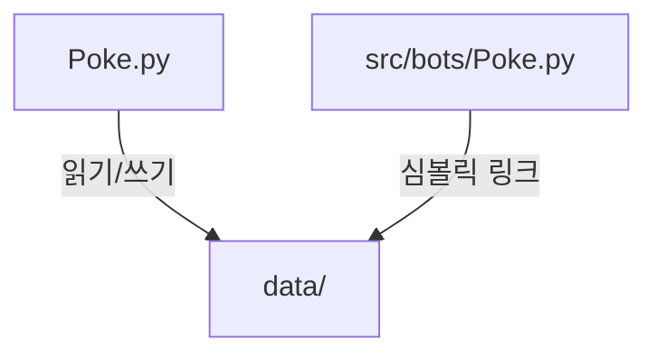

# MCP 및 프로젝트 관리 도구 추천

## 1. 다이어그램 및 아키텍처 시각화 도구

### **Mermaid** (현재 사용 중) ⭐⭐⭐⭐⭐
- **장점**: Markdown에 직접 삽입, GitHub/VS Code 지원
- **용도**: 플로우차트, 시퀀스 다이어그램, 클래스 다이어그램
- **예시**:


### **PlantUML** ⭐⭐⭐⭐
- **장점**: 복잡한 UML 다이어그램, 텍스트 기반
- **VS Code 확장**: PlantUML
- **용도**: 클래스 관계, 컴포넌트 다이어그램

### **Draw.io (diagrams.net)** ⭐⭐⭐⭐⭐
- **장점**: 무료, 웹 기반, 다양한 템플릿
- **VS Code 확장**: Draw.io Integration
- **용도**: 복잡한 아키텍처 다이어그램

### **Excalidraw** ⭐⭐⭐⭐
- **장점**: 손그림 스타일, 빠른 스케치
- **VS Code 확장**: Excalidraw
- **용도**: 아이디어 브레인스토밍, 간단한 다이어그램

## 2. Discord 봇 개발 전용 도구

### **Discord Developer Portal**
- 봇 권한 계산기
- 채널 ID 확인 도구
- https://discord.com/developers/applications

### **Postman/Insomnia**
- Discord API 테스트
- Webhook 테스트

## 3. 프로젝트 구조 관리 도구

### **tree** (명령줄 도구)
```bash
# 프로젝트 구조 시각화
tree -I 'venv|__pycache__|*.pyc' > project_structure.txt
```

### **Project Manager** (VS Code 확장)
- 프로젝트 간 빠른 전환
- 프로젝트별 설정 관리

### **Better Comments** (VS Code 확장)
- TODO, FIXME 등 주석 하이라이트
- 중요 주석 구분

## 4. 코드 분석 및 의존성 시각화

### **pydeps**
```bash
pip install pydeps
pydeps src --cluster --max-bacon 2 -o dependencies.svg
```

### **pyreverse** (Pylint 포함)
```bash
pyreverse -o svg -p PTCGPBkor src/
```

## 5. 프로세스 모니터링

### **htop** (Linux/Mac)
- 실시간 프로세스 모니터링
- CPU/메모리 사용량 확인

### **PM2** (Node.js 기반)
```bash
npm install -g pm2
pm2 start Poke.py --interpreter python3
pm2 monit
```

## 6. 로그 관리

### **Loguru** (Python 라이브러리)
```python
from loguru import logger
logger.add("logs/bot_{time}.log", rotation="1 day")
```

### **tail -f** (실시간 로그 확인)
```bash
tail -f logs/*.log | grep ERROR
```

## 7. 테스트 및 디버깅

### **pytest**
```bash
pytest tests/ -v --cov=src
```

### **Python Debugger** (VS Code 내장)
- 브레이크포인트 설정
- 변수 검사

## 8. 문서화

### **Sphinx**
- Python 프로젝트 문서화
- 자동 API 문서 생성

### **MkDocs**
- Markdown 기반 문서 사이트
- 검색 기능 포함

## 권장 조합

1. **아키텍처 설계**: Mermaid + Draw.io
2. **코드 분석**: pydeps + pyreverse
3. **모니터링**: PM2 + htop
4. **문서화**: Markdown + Mermaid

## VS Code 필수 확장 프로그램
1. Python
2. Pylance
3. Markdown Preview Mermaid Support
4. Draw.io Integration
5. GitLens
6. Better Comments
7. Project Manager

이 도구들을 활용하면 프로젝트 구조를 더 잘 이해하고 관리할 수 있습니다!