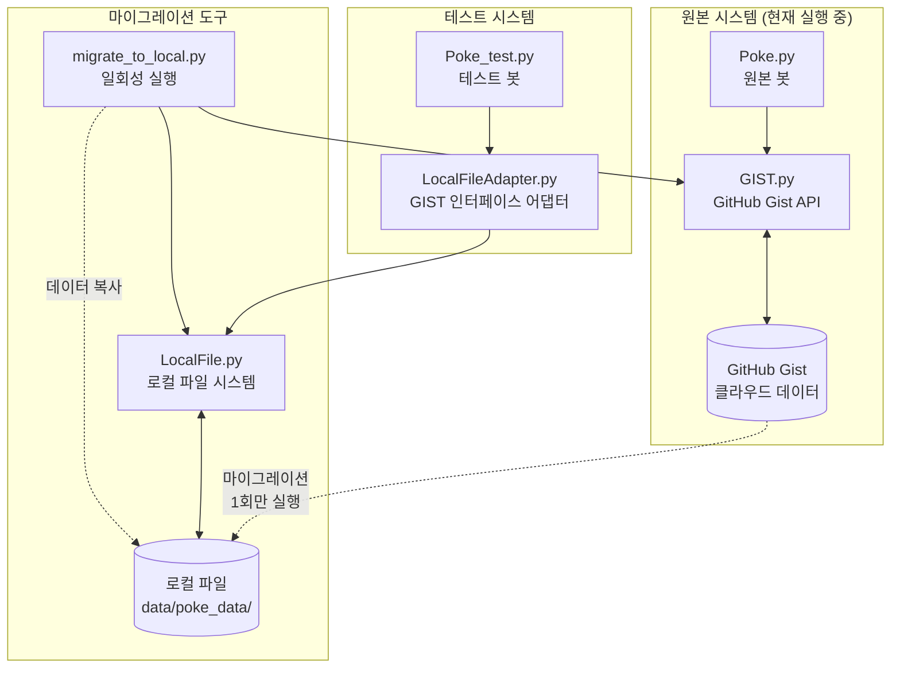
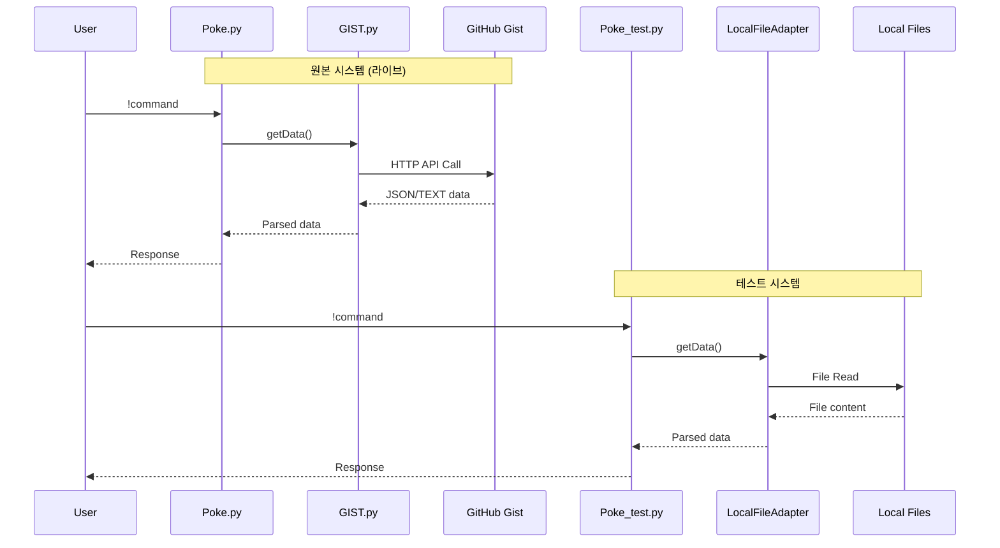
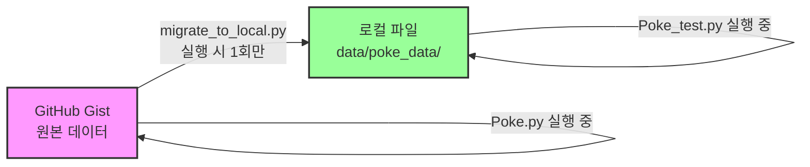
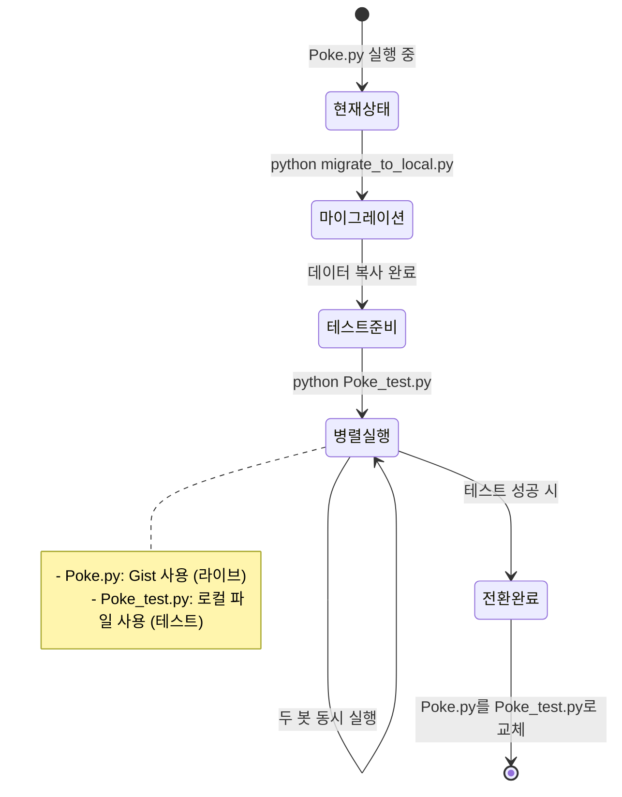

# PTCGP 봇 시스템 아키텍처 설명

## 1. 파일 구조 및 관계



## 2. 각 파일의 역할

### **Poke.py (원본)**
- 현재 라이브 서비스 중
- GitHub Gist를 데이터베이스로 사용
- 네트워크를 통해 데이터 읽기/쓰기

### **Poke_test.py (테스트 버전)**
- Poke.py의 복사본
- TEST_MODE=True 플래그 추가
- import 부분만 변경: `import LocalFileAdapter as GIST`
- **Poke_local.py는 존재하지 않음** (혼동이 있었던 것 같습니다)

### **LocalFileAdapter.py**
- GIST.py와 동일한 인터페이스 제공
- 내부적으로 LocalFile.py 사용
- Poke_test.py가 수정 없이 작동하도록 하는 어댑터

### **migrate_to_local.py**
- 일회성 실행 스크립트
- Gist → 로컬 파일로 데이터 복사
- 한 번만 실행하면 됨

## 3. 데이터 흐름



## 4. 마이그레이션은 언제 일어나나?



### **마이그레이션 타이밍**:
1. `migrate_to_local.py`를 실행할 때 **1회만** 발생
2. Poke_test.py 실행 중에는 마이그레이션 없음 (로컬 파일만 사용)
3. Poke.py는 여전히 Gist 사용 (마이그레이션과 무관)

## 5. 실제 사용 시나리오



## 6. 장단점 비교

| 항목 | Poke.py (원본) | Poke_test.py (테스트) |
|------|----------------|----------------------|
| 데이터 저장 | GitHub Gist | 로컬 파일 |
| 네트워크 의존성 | 있음 | 없음 |
| API 제한 | 있음 (시간당 5000회) | 없음 |
| 속도 | 느림 (네트워크 지연) | 빠름 (로컬 I/O) |
| 백업 | GitHub가 관리 | 수동 백업 필요 |
| 동시 접근 | API가 처리 | 파일 잠금 필요 |

## 7. 데이터 동기화

```
주의: 마이그레이션 후에는 데이터가 분리됩니다!

Poke.py가 Gist에 쓴 새 데이터 → Poke_test.py는 모름
Poke_test.py가 로컬에 쓴 데이터 → Poke.py는 모름

필요시 재마이그레이션 또는 수동 동기화 필요
```

## 8. MCP 도구 추천

시스템 구조를 더 잘 이해하고 관리하기 위한 도구들:

1. **Mermaid** (위에서 사용 중)
   - 다이어그램을 코드로 작성
   - GitHub, VS Code에서 바로 렌더링

2. **PlantUML**
   - 더 복잡한 UML 다이어그램
   - 시퀀스, 클래스, 컴포넌트 다이어그램

3. **Draw.io (diagrams.net)**
   - 웹 기반 무료 다이어그램 도구
   - 실시간 협업 가능

4. **Excalidraw**
   - 손그림 스타일의 다이어그램
   - 빠른 스케치에 유용

이 문서의 Mermaid 다이어그램은 VS Code의 Markdown Preview Enhanced 확장이나 GitHub에서 바로 볼 수 있습니다!